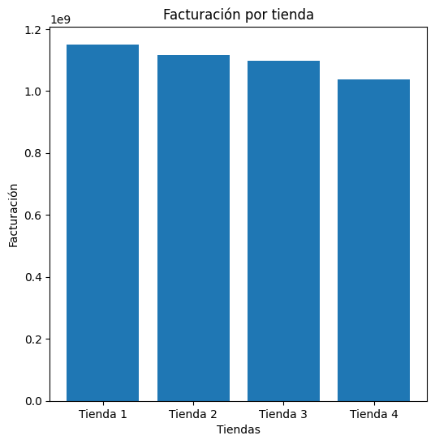
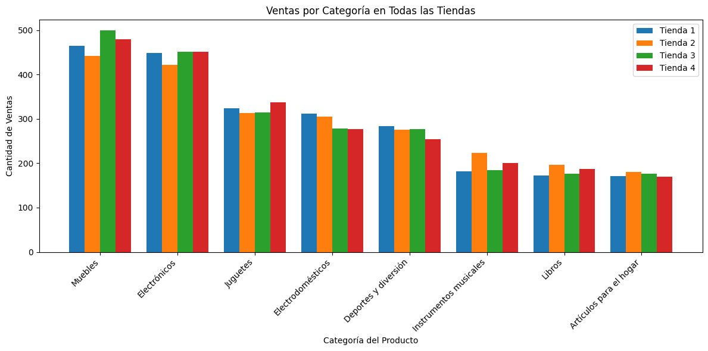
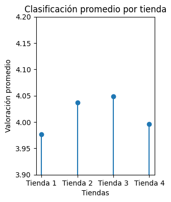

# Proyecto de Análisis de Datos: Alura Store

Este proyecto tiene como objetivo principal analizar los datos de ventas y rendimiento de varias tiendas de **Alura Store** para identificar la tienda con el rendimiento más bajo y, en última instancia, recomendar su posible cierre o la implementación de mejoras específicas.

## Propósito del Análisis

## Estructura del Proyecto

El proyecto está organizado de la siguiente manera:

- `alura_store_analisis.ipynb`: El cuaderno Jupyter principal que contiene todo el código fuente para la carga de datos, el preprocesamiento, el análisis estadístico y la generación de visualizaciones.
-  carpeta graficos: 
- `ventas-por-categoria-todas-las-tiendas`: Imagen con las ventas por categorías (Grafico barras apiladas).
- `facturacion-por-tienda`: Imagen con la facturación por tienda (Grafico de barras simple).
- `clasificacion-promedio-por-tienda`: Imagen con la clasificacion promedio por tienda (Grafico de tallo).
- `README.md`: Este archivo de documentación del proyecto.
- `LICENSE.md`: Archivo con la licencia de uso del proyecto.
## Análisis y Visualizaciones Clave

A continuación se presentan los gráficos más relevantes generados durante el análisis, junto con los insights clave obtenidos:

### 1. Facturación Total por Tienda

 
### 2. Ventas por Categoría en Todas las Tiendas


### 3. Calificación Promedio de Clientes por Tienda

 
## Cómo Ejecutar el Análisis

Para ejecutar este análisis en tu entorno local, sigue estos pasos:

1.  **Requisitos Previos:**
    * [Python](https://www.python.org/downloads/) (versión 3.x o superior)
    * [Jupyter Notebook](https://jupyter.org/install) o [JupyterLab](https://jupyter.org/install)

2.  **Instalación de Librerías:**
    Abre tu terminal o símbolo del sistema y ejecuta el siguiente comando para instalar las librerías necesarias:
    ```bash
    pip install pandas numpy matplotlib
    ```

3.  **Clonar el Repositorio (si aplica):**
    Si este proyecto está en un repositorio Git (ej. GitHub), clónalo a tu máquina local:
    ```bash
    gh repo clone NecrogesZ/challenge-alura-store(https://github.com/NecrogesZ/challenge-alura-store.git)
    cd nombre_del_repositorio
    ```
    4.  **Ejecutar el Cuaderno Jupyter:**
    Navega al directorio del proyecto en tu terminal y abre Jupyter Notebook/Lab:
    ```bash
    jupyter notebook
    ```
    O
    ```bash
    jupyter lab
    ```
    Esto abrirá tu navegador predeterminado con la interfaz de Jupyter. Haz clic en `Challenge 1 data science.ipynb` para abrir el cuaderno.

5.  **Ejecutar las Celdas:**
    Dentro del cuaderno, puedes ejecutar las celdas una por una o todas a la vez para replicar el análisis y las visualizaciones.


